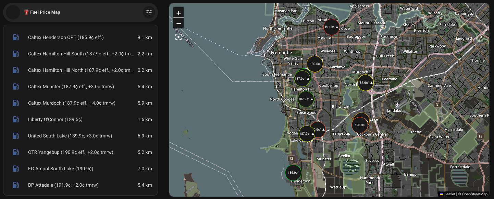
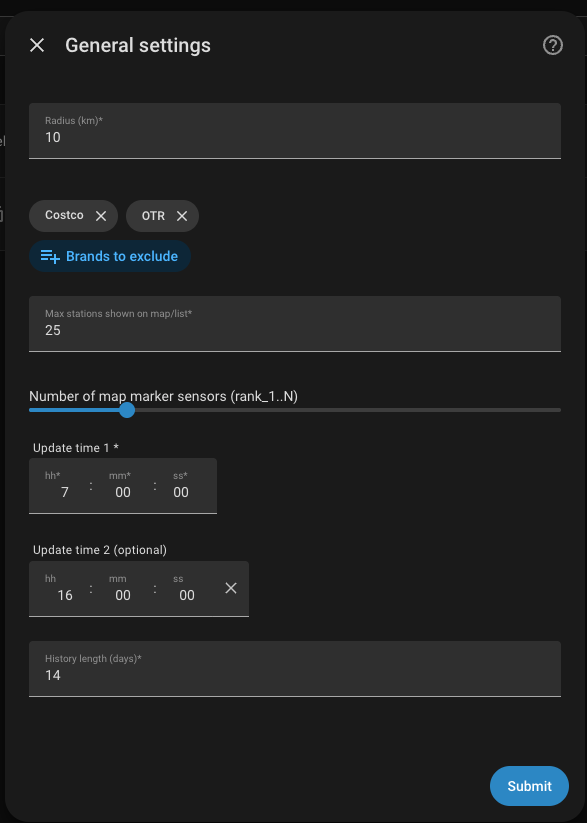

# Fuel Price Map (Home Assistant custom integration)

Tracks fuel prices near your home from a state/national fuel-price API and
shows them as a map + sorted list, in the style of the attached Bubble Card
example.

First provider: **FuelWatch (Western Australia)**, using their public RSS
feed (no API key). Built as a `providers/` module so other state/national
APIs can be added later without touching the coordinator, sensors, or
frontend.

`examples/` has a full dashboard YAML and a standalone (non-HA) CLI script
for querying FuelWatch directly from the terminal - neither is required for
the integration itself, both are just handy references.

## Install/upgrade

### Via HACS (recommended)
1. HACS → ⋮ (top right) → **Custom repositories**
2. Add this repo's URL, category **Integration**
3. Search HACS for "Fuel Price Map", install, restart Home Assistant
4. **Settings → Devices & Services → Add Integration → "Fuel Price Map"**

Future updates then show up as normal HACS updates, tied to GitHub releases
on this repo (tag a release matching `manifest.json`'s `version` each time
you cut one).

### Manual (fallback)
1. Copy `custom_components/fuel_price_map/` into your Home Assistant
   `config/custom_components/` folder, **replacing** the existing one.
2. Restart Home Assistant.
3. Remove the existing "Fuel Price Map" integration entry first, then **Settings → Devices & Services → Add
   Integration → "Fuel Price Map"** to re-add it.
4. Setup steps:
   - Provider (FuelWatch WA for now)
   - Home coordinates (defaults to your HA home zone) + radius (km)
   - Fuel types to track + brands to exclude (Costco pre-selected)
5. Options (gear icon) let you change radius, excluded brands, max stations
   shown, the two daily update times, and history length afterwards.

Note: dense metro radii pull in a lot of suburbs (e.g. ~90 within 10 km of
central Perth) — each is a separate request, throttled to 8 concurrent, still
only run 2x/day. Smaller radii mean fewer, faster fetches.

## What gets created

| Entity | Count | Purpose |
|---|---|---|
| `sensor.<fuel_type>_lowest_price` | 1 per configured fuel type | Cheapest in-radius price; carries the 14-day/2x-daily `history` attribute used by the history card |
| `sensor.fuel_price_map_rank_1` .. `_N` | Fixed, `map_marker_count` (default 10) | Live map markers — values track the current fuel/brand selection; see "Frontend" below |
| `select.fuel_type` | 1 | Menu control — which fuel type the map/list currently shows |
| `select.preferred_brand` | 1 | Menu control — optional brand filter (Any = no filter) |
| `select.sort_order` | 1 | "Cheapest first" / "Nearest first" — controls only the map's rank sensors, not the price list |
| `geo_location.*` | one per in-radius station for the *currently selected* fuel type | Map markers only; not recorded/persisted, regenerated on each fetch or selection change |

This keeps entity count to "a handful" regardless of how many stations exist
nearby — no per-station sensor, no per-station recorder history.

## Data refresh

Fetched on a schedule (default 07:00 and 16:00, configurable, max 2/day) via
`async_track_time_change`, not continuous polling — matches FuelWatch's fair
use expectations and the "twice a day" requirement.

## Frontend

See `examples/example_dashboard.yaml`:
- Left menu: Bubble Card pop-up with the two select entities + a sorted price
  list (uses `auto-entities`, sorted by the `price` attribute on the
  geo_location entities), wrapped with `card_mod` for a fixed-height
  scrollable box.
- Map: **[ha-map-card](https://github.com/nathan-gs/ha-map-card)** (HACS —
  search "Map Card" by nathan-gs, or manual install per its README). Not the
  built-in `map` card, since this one supports per-marker price labels via
  `display: attribute`.
  - Points at `sensor.fuel_price_map_rank_1` .. `_10` — a small **fixed**
    set of entity IDs (see "Map marker sensors" below) whose *values* track
    whatever fuel type / brand is currently selected, so the dashboard YAML
    never needs to change when you use the dropdowns.
  - `map_marker_count` (default 10, now in **Options** — no need to edit
    storage by hand) controls how many `rank_N` sensors exist — add/remove
    matching rows in the map card's `entities:` list if you change it.
  - `select.sort_order` ("Cheapest first" / "Nearest first") controls what
    the rank sensors are sorted by. Distance sort uses the full in-radius
    station list (not just the price-truncated subset), so a nearby-but-not-
    cheap station won't be missed just because it wasn't in the top
    `max_stations` by price.
- Home-screen tile: small Bubble Card button bound to a `sensor.*_lowest_price`,
  tapping it opens a pop-up with an `apexcharts-card` reading the 14-day
  history straight out of the sensor's `history` attribute (no recorder
  history needed).

`auto-entities`, `card_mod`, and `apexcharts-card` are optional HACS cards —
swap for plain `entities`/`history-graph` cards if you'd rather not add them.

## Extending with another provider

Add `providers/<name>.py` implementing the `FuelPriceProvider` protocol
(`providers/__init__.py`), register it in `const.PROVIDERS` and
`config_flow._provider_fuel_types` / `_provider_brand_names`, and it's
selectable in the provider dropdown at setup — the coordinator, sensors,
selects, and map are provider-agnostic.

## Ideas for later (not implemented yet)

1. **Next-day trend indicator** — ✅ implemented (v0.7.0). FuelWatch publishes
   tomorrow's price from ~2:30pm-11:59pm WA time; a dedicated fetch runs at
   14:35 daily and validates the returned data's own date field actually
   says tomorrow (the feed silently falls back to today's data outside that
   window instead of erroring, confirmed by direct testing) before caching
   anything. `trend_cents` is exposed as an attribute everywhere price is
   shown. Display: the "cheapest nearby" list shows `+3.0¢ tmrw` /
   `-2.0¢ tmrw` in the row name (plain text - colouring it red/green would
   need a card_mod treatment, not done yet); the map marker gets a small
   ▲/▼ appended via the same pre-baked `map_label` attribute pattern used
   for the discount `*`. Staleness: the cache is tagged with which calendar
   date it's valid for and checked against the real date on every read, so
   it auto-expires at midnight with no explicit cleanup step needed.
2. **Loyalty/discount cards** — ✅ config + ranking logic implemented (v0.6.0):
   Settings → Fuel Price Map → Options → "Manage brand discounts" lets you
   add/remove a cents-per-litre discount per brand. Discounted brands are
   used for sorting/ranking everywhere ("cheapest" now means cheapest
   *after* your discount), and the raw price stays what's actually
   displayed - the discount is exposed as its own `discount_cents` /
   `effective_price` attribute on every price-showing entity, ready for a
   visual "-4¢" treatment. **Still open**: actually showing that on the map
   marker itself depends on `ha-map-card`'s marker templating, which hasn't
   been checked yet - the list and popups already have the data available.
3. **Cross-checking sources** — a second WA provider (or a national aggregator) alongside FuelWatch for the same region, shown side by side for sanity-checking.
4. **Another country/provider** — e.g. Germany (Tankerkönig API is the usual candidate) — this is what the `providers/` module structure was built for.
5. **Further interface add-ons** — TBD, to be discussed.
6. **Click a list entry to focus/zoom the map on it** — investigated; not
   straightforward with the current stock-card approach. Lovelace card
   configs (including `ha-map-card`'s pan/zoom target) are static at render
   time — there's no built-in way for one card to tell another "re-center
   here" at runtime without either a custom card (the exact debugging pain
   we just moved away from) or a helper-entity + automation chain whose
   reliability I haven't verified. What you get for free today: tapping a
   list row already opens that station's more-info dialog with full
   details. Worth a dedicated look later rather than a quick add-on.
7. **Suburb coordinates from a live API** (e.g. postcodeapi.com.au) instead
   of the bundled `wa_suburb_coords.json`. Would eliminate the "hand-typed
   list had a spelling gap" class of bug entirely. Best done as a periodic
   regeneration of the bundled file rather than a live per-fetch call, to
   avoid adding a runtime dependency on a third-party API's uptime.
8. **"Nearest to current location" as a second hub.** Most of the fetch
   pipeline (suburb resolution, radius filter) already recomputes from
   whatever lat/lon it's given each cycle - it's not hardcoded to a fixed
   home point. What's genuinely new: reading a `device_tracker`/`person`
   entity's live position instead of a static coordinate, and an on-demand
   refresh trigger instead of the twice-daily schedule (which is
   intentionally tuned for a static point, not a moving one). Recommend a
   separate config entry/hub for this rather than a mode on the existing
   one, so the home setup's simple scheduled behaviour stays untouched.

## Known limitations / things worth reviewing together

- FuelWatch has no direct "radius" query — we query by suburb (+ surrounding
  suburbs) and then filter to the exact radius client-side using the
  station's own lat/lon. If your suburb's "surrounding" set doesn't fully
  cover your radius, widen the suburb or we can add multi-suburb querying.
- FuelWatch RSS field names were confirmed against their published docs and
  open-source clients, not a live test call from this environment — worth a
  first real fetch to sanity check.
- No brand-code filtering at the API level; exclusion is done by matching the
  returned brand name string, case-insensitively.
